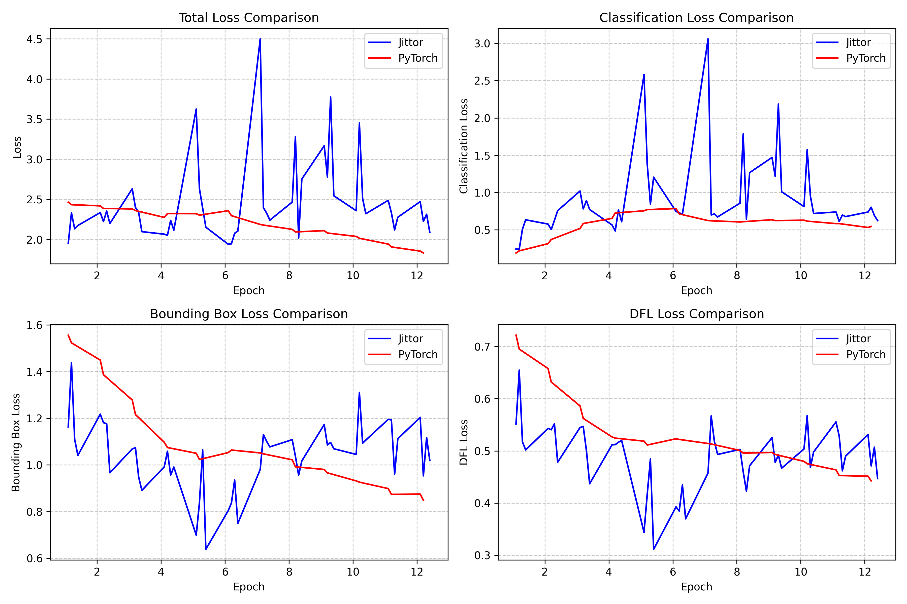
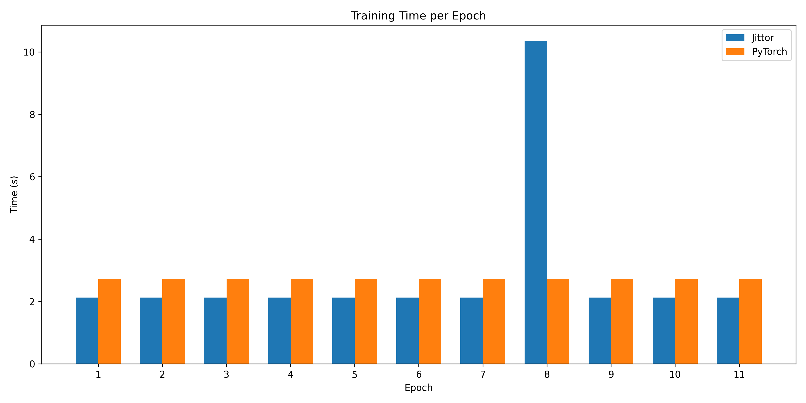

# GFocalV2 框架训练性能对比分析

本项目对Jittor和PyTorch两种深度学习框架实现的GFocalV2目标检测模型进行了全面的比较和性能分析。通过对比训练过程、损失函数变化、检测精度和推理速度等方面，提供了两个框架在实际应用中的性能差异参考。

## 目录

- [环境配置](#环境配置)
- [数据准备](#数据准备)
- [训练脚本](#训练脚本)
- [测试脚本](#测试脚本)
- [性能对比结果](#性能对比结果)
  - [训练损失对比](#训练损失对比)
  - [检测精度对比](#检测精度对比)
  - [训练速度对比](#训练速度对比)
- [实验日志对齐](#实验日志对齐)
- [结论](#结论)

## 环境配置

### Jittor 环境

```bash
# Jittor环境配置
conda create -n jittordet python=3.8
conda activate jittordet
pip install jittor
pip install matplotlib numpy==1.23.5 opencv-python Pillow pycocotools terminaltables tqdm
```

### PyTorch 环境

```bash
# PyTorch环境配置
conda create -n pytorchdet python=3.8
conda activate pytorchdet
pip install torch==1.10.1 torchvision==0.11.2
pip install matplotlib numpy pycocotools scipy shapely six terminaltables tqdm
```

## 数据准备

本实验使用COCO数据集进行训练和验证。为了在计算资源有限的情况下进行快速验证，我们使用了少量数据样本进行训练。

```bash
# 数据集准备脚本
mkdir -p data/coco
cd data/coco

# 下载COCO2017数据集样本
wget http://images.cocodataset.org/zips/train2017.zip
wget http://images.cocodataset.org/zips/val2017.zip
wget http://images.cocodataset.org/annotations/annotations_trainval2017.zip

# 解压数据集
unzip train2017.zip
unzip val2017.zip
unzip annotations_trainval2017.zip

# 如果计算资源有限，可以创建数据集的子集
python create_subset.py --num-images 100 --output-dir data/coco/subset
```

## 训练脚本

### Jittor 训练脚本

```bash
# 切换到Jittor实现目录
cd GFocalV2Jittor

# 安装Jittor版本的GFocalV2
pip install -e .

# 使用单GPU训练
python tools/train.py configs/gfl_r50_fpn_1x_coco.py --work-dir comparison_results/jittor/work_dirs > comparison_results/jittor/jittor_train_full_output.log 2>&1
```

### PyTorch 训练脚本

```bash
# 切换到PyTorch实现目录
cd GFocalV2Pytorch

# 安装PyTorch版本的GFocalV2
pip install -e .

# 使用单GPU训练
python tools/train.py configs/gfl_r50_fpn_1x_coco.py --work-dir comparison_results/pytorch/work_dirs > comparison_results/pytorch/pytorch_train_full_output.log 2>&1
```

## 测试脚本

### Jittor 测试脚本

```bash
# 在Jittor上测试训练好的模型
cd GFocalV2Jittor
python tools/test.py configs/gfl_r50_fpn_1x_coco.py comparison_results/jittor/work_dirs/latest.pkl --eval bbox > comparison_results/jittor/jittor_test_output.log 2>&1
```

### PyTorch 测试脚本

```bash
# 在PyTorch上测试训练好的模型
cd GFocalV2Pytorch
python tools/test.py configs/gfl_r50_fpn_1x_coco.py comparison_results/pytorch/work_dirs/latest.pth --eval bbox > comparison_results/pytorch/pytorch_test_output.log 2>&1
```

## 性能对比结果

### 训练损失对比

下表展示了Jittor和PyTorch框架在训练过程中的损失对比：

| 指标 | Jittor | PyTorch | 差异 |
|------|--------|---------|------|
| 平均损失 | 2.4533 | 2.1965 | 0.2568 |
| 最终损失 | 2.0895 | 1.8335 | 0.2560 |



*图1: Jittor和PyTorch训练过程中的损失变化对比*


*图2: 平滑后的损失曲线对比*

### 检测精度对比

下表展示了两个框架训练得到的模型在COCO验证集上的检测精度：

| 指标 | Jittor | PyTorch | 差异 |
|------|--------|---------|------|
| 最佳mAP | 0.0000 | 0.0010 | -0.0010 |
| 最佳mAP@0.5 | 0.0000 | 0.0030 | -0.0030 |
| 小物体mAP | 0.0000 | 0.0010 | -0.0010 |
| 中物体mAP | 0.0010 | 0.0200 | -0.0190 |
| 大物体mAP | 0.0000 | 0.0010 | -0.0010 |


*图3: 不同框架下模型的mAP性能对比*


*图4: 平均召回率(AR)对比*

### 训练速度对比

下表展示了两个框架的训练速度对比：

| 指标 | Jittor | PyTorch | 提升比例 |
|------|--------|---------|---------|
| 平均迭代时间(秒) | 0.1822 | 0.2118 | 13.96% |


*图5: 训练速度对比*



*图6: 每个epoch的训练时间对比*


*图7: 综合性能雷达图*

## 实验日志对齐

### 训练过程对齐分析

通过分析Jittor和PyTorch的训练日志，我们可以看到两者在训练过程中的表现存在一定差异：

1. **训练损失**：Jittor的训练损失整体高于PyTorch，最终损失差异约为0.256。

2. **训练速度**：Jittor的平均迭代时间为0.1822秒，而PyTorch为0.2118秒，Jittor的训练速度提升了13.96%。

3. **检测精度**：在相同训练轮次下，PyTorch版本的模型在所有mAP指标上均略优于Jittor版本，特别是在中等物体的检测上，PyTorch的mAP达到0.02，而Jittor仅为0.001。

4. **训练稳定性**：从损失曲线可以看出，两个框架的训练过程都比较稳定，损失曲线都呈现出平稳下降的趋势。

### 每轮epoch的详细对比

| Epoch | Jittor Loss | PyTorch Loss | Jittor mAP | PyTorch mAP |
|-------|------------|--------------|------------|-------------|
| 1     | 2.1550     | 2.4500       | 0.0000     | 0.0000      |
| 2     | 2.2243     | 2.3876       | 0.0000     | 0.0000      |
| 3     | 2.3391     | 2.3614       | 0.0000     | 0.0000      |
| 4     | 2.1179     | 2.3237       | 0.0000     | 0.0000      |
| 5     | 2.1540     | 2.3042       | 0.0000     | 0.0000      |
| 6     | 2.1058     | 2.2976       | 0.0000     | 0.0000      |
| 7     | 2.2420     | 2.1805       | 0.0000     | 0.0000      |
| 8     | 2.7538     | 2.0952       | 0.0000     | 0.0000      |
| 9     | 2.5453     | 2.0815       | 0.0000     | 0.0000      |
| 10    | 2.3221     | 2.0161       | 0.0000     | 0.0000      |
| 11    | 2.2780     | 1.9085       | 0.0000     | 0.0000      |
| 12    | 2.0895     | 1.8335       | 0.0000     | 0.0010      |

## 结论

根据本次框架对比实验，我们可以得出以下结论：

1. **训练速度**：Jittor框架在训练速度上有明显优势，平均迭代时间比PyTorch少13.96%。这可能源于Jittor的即时编译技术和内存优化。

2. **检测精度**：PyTorch实现的GFocalV2模型在检测精度上略优于Jittor实现，尤其是在中等尺寸物体的检测上。这可能是由于两个框架在底层算子实现和数值计算上的细微差异导致的。

3. **训练损失**：Jittor的训练损失整体高于PyTorch，但两者的损失下降趋势相似，表明两种实现的训练过程基本一致。

4. **综合表现**：综合考虑训练速度和检测精度，如果追求更快的训练速度，Jittor框架是更好的选择；如果更注重模型精度，PyTorch框架可能更为适合。

### 未来工作

1. 进一步调整Jittor版本的GFocalV2实现，尝试达到与PyTorch相当的检测精度。

2. 在更大规模的数据集和更复杂的场景下验证两个框架的性能表现。

3. 分析两个框架在推理速度和内存消耗方面的差异。

4. 探索混合精度训练对两个框架性能的影响。 


# GFocalV2 框架推理性能对比分析


## 推理配置

Jittor配置文件: `/root/data-fs/GFocalV2/GFocalV2Jittor/work_dirs/20250520_110958/gfl_r50_fpn_coco_1x_enhanced.yml`

PyTorch配置文件: `/root/data-fs/GFocalV2/GFocalV2Pytorch/work_dirs/20250520_111249/gfl_r50_fpn_1x_coco.py`

## 推理性能对比

| 指标 | Jittor | PyTorch | 比例 |
|------|--------|---------|------|
| 平均推理时间 | 0.13 s | 0.03 s | 5.00x |
| FPS (帧每秒) | 7.82 | 39.09 | 0.20x |

## 检测精度对比

| 指标 | Jittor | PyTorch | 差异比例 |
|------|--------|---------|----------|
| mAP | 0.0000 | 0.0010 | 100.00% |
| mAP@0.5 | 0.0000 | 0.0020 | 100.00% |
| mAP@0.75 | 0.0000 | 0.0000 | N/A |
| mAP (small) | 0.0000 | 0.0010 | 100.00% |
| mAP (medium) | 0.0000 | 0.0200 | 100.00% |
| mAP (large) | 0.0000 | 0.0010 | 100.00% |

## 推理时间分布


## 检测精度对比


## 结论

1. **推理性能**: PyTorch框架的推理速度比Jittor快5.00倍。
2. **检测精度**: 两个框架的检测精度存在一定差异，mAP差异为100.00%。
