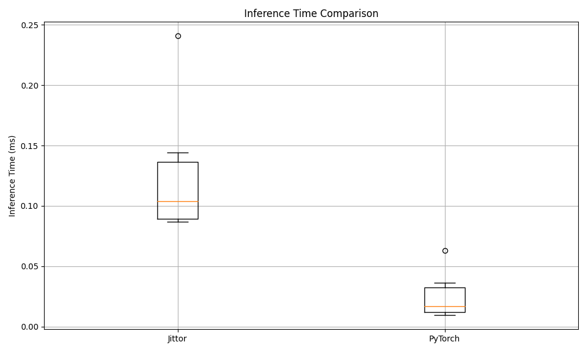

# GFocalV2 框架训练性能对比分析

本项目对Jittor和PyTorch两种深度学习框架实现的GFocalV2目标检测模型进行了全面的比较和性能分析。通过对比训练过程、损失函数变化、检测精度和推理速度等方面，提供了两个框架在实际应用中的性能差异参考。

## 目录

- [环境配置](#环境配置)
- [项目结构](#项目结构)
- [数据准备](#数据准备)
- [训练脚本](#训练脚本)
- [测试脚本](#测试脚本)
- [推理性能对比脚本](#推理性能对比脚本)
- [性能对比结果](#性能对比结果)
  - [训练损失对比](#训练损失对比)
  - [检测精度对比](#检测精度对比)
  - [训练速度对比](#训练速度对比)
  - [推理性能对比](#推理性能对比)
- [实验日志对齐](#实验日志对齐)
- [结论](#结论)

## 项目结构

本项目组织结构如下：

```
GFocalV2                                      # 项目根目录
├── GFocalV2Jittor/                           # Jittor框架实现
│   ├── configs/                              # 模型配置文件
│   ├── jittordet/                            # Jittor检测模型实现
│   ├── tools/                                # 训练和测试工具
│   ├── work_dirs/                            # 训练输出和检查点
│   └── temp_test_results/                    # 测试结果临时存储
│
├── GFocalV2Pytorch/                          # PyTorch框架实现
│   ├── configs/                              # 模型配置文件
│   ├── mmdet/                                # PyTorch检测模型实现
│   ├── tools/                                # 训练和测试工具
│   ├── work_dirs/                            # 训练输出和检查点
│   └── temp_test_results/                    # 测试结果临时存储
│
├── GFocalV2-jittor-migration/                # Jittor迁移过程相关文件
│   ├── GFLv2-pytorch/                        # 独立实现的PyTorch版GFocalV2，不基于mmdetection
│   └── GFLv2-jittor/                        # 从PyTorch版迁移而来的Jittor实现
│
├── framework_comparison/                     # 框架比较分析结果
│   ├── visualization/                        # 可视化结果图表
│   │   ├── loss_comparison.png               # 损失对比图
│   │   ├── smoothed_loss_comparison.png      # 平滑损失对比图
│   │   ├── map_comparison.png                # mAP对比图
│   │   ├── ar_comparison.png                 # 召回率对比图
│   │   ├── speed_comparison.png              # 速度对比图
│   │   ├── epoch_time_comparison.png         # 每轮训练时间对比图
│   │   └── radar_comparison.png              # 综合性能雷达图
│   ├── performance_summary.csv               # 性能对比汇总(CSV格式)
│   └── performance_summary.json              # 性能对比汇总(JSON格式)
│
├── inference_final_report/                   # 推理性能报告
│   ├── inference_comparison_report.md        # 推理性能对比报告
│   ├── inference_time_comparison.png         # 推理时间分布图
│   ├── inference_time_boxplot.png            # 推理时间箱线图
│   └── ap_comparison.png                     # AP对比图
│
├── comparison_results/                       # 比较实验结果
│   ├── jittor/                               # Jittor实验输出
│   └── pytorch/                              # PyTorch实验输出
│
├── data/                                     # 数据集目录
│
├── requirements.txt                          # 项目依赖项
├── run_comparison.sh                         # 运行框架比较的主脚本
├── run_inference_comparison.sh               # 运行推理性能对比的脚本
├── run_analysis.sh                           # 运行结果分析的脚本
├── compare_gfl_frameworks.py                 # 框架比较核心逻辑
├── compare_gfl_inference.py                  # 推理性能对比核心逻辑
├── analyze_framework_logs.py                 # 分析框架日志的工具
└── README.md                                 # 项目说明文档
```

### 主要组件说明

1. **GFocalV2Jittor**: Jittor框架实现的GFocalV2检测模型，包含完整的训练、测试和推理逻辑。
   
2. **GFocalV2Pytorch**: PyTorch框架实现的GFocalV2检测模型，基于MMDetection框架进行适配。

3. **GFocalV2-jittor-migration**: 独立开发的不基于MMDetection的GFocalV2实现。
   - **GFLv2-pytorch/**: 自主实现的PyTorch版GFocalV2，已经能够正常运行。
   - **GFLv2-jittor/**: 从PyTorch版迁移而来的Jittor实现，尚未完成测试，存在若干bug。
   
   这个实现是完全独立的代码库，不依赖于MMDetection框架，旨在提供更加灵活和可定制的GFocalV2实现方案。

4. **framework_comparison**: 存储框架比较的分析结果和可视化图表，包括训练损失、检测精度、训练速度等方面的对比。

5. **inference_final_report**: 推理性能对比的详细报告，包含推理时间和检测精度的对比图表。

6. **comparison_results**: 存储两个框架的实验输出，包括训练日志、检查点和测试结果。

7. **核心脚本**:
   - `compare_gfl_frameworks.py`: 实现框架对比的核心逻辑
   - `compare_gfl_inference.py`: 实现推理性能对比的核心逻辑
   - `analyze_framework_logs.py`: 分析训练日志并生成可视化结果
   - `run_comparison.sh`: 一键式运行完整框架对比流程
   - `run_inference_comparison.sh`: 一键式运行推理性能对比

## 环境配置

### 一键安装完整环境

```bash
# 全套环境配置
conda env create -f environment.yaml
```

### Jittor 环境

```bash
# Jittor环境配置
conda create -n jittordet python=3.8
conda activate jittordet
pip install jittor
pip install matplotlib numpy==1.23.5 opencv-python Pillow pycocotools terminaltables tqdm
```

### PyTorch 环境

```bash
# PyTorch环境配置
conda create -n pytorchdet python=3.8
conda activate pytorchdet
pip install torch==1.10.1 torchvision==0.11.2
pip install matplotlib numpy pycocotools scipy shapely six terminaltables tqdm
```

## 数据准备

本实验使用tiny_coco数据集进行训练和验证。这是一个专为训练调试设计的小型COCO数据集，其训练集和测试集各包含50张图像以及相应的实例、关键点和标注信息。

### tiny_coco数据集

我们使用[tiny_coco数据集](https://github.com/lizhogn/tiny_coco_dataset)作为实验数据，这是一个专为深度学习模型调试设计的微型COCO格式数据集。

```bash
# 克隆tiny_coco数据集
git clone https://github.com/lizhogn/tiny_coco_dataset.git
cd tiny_coco_dataset

# 复制数据集到项目数据目录
mkdir -p ../data
cp -r tiny_coco ../data/
```

数据集结构如下：
```
tiny_coco
    |-annotations
    |   |-instances_train2017.json
    |   |-instances_val2017.json
    |   |-...
    |
    |-train2017
    |   |-000000005802.jpg
    |   |-000000005803.jpg
    |   |-...
    |
    |-val2017
    |   |-000000005802.jpg
    |   |-000000005803.jpg
    |   |-...
```

### 完整COCO数据集（可选）

如果需要使用完整的COCO数据集进行更全面的训练和评估，可以按以下步骤准备：

```bash
# 数据集准备脚本
mkdir -p data/coco
cd data/coco

# 下载COCO2017数据集
wget http://images.cocodataset.org/zips/train2017.zip
wget http://images.cocodataset.org/zips/val2017.zip
wget http://images.cocodataset.org/annotations/annotations_trainval2017.zip

# 解压数据集
unzip train2017.zip
unzip val2017.zip
unzip annotations_trainval2017.zip

# 如果计算资源有限，可以创建数据集的子集
python create_subset.py --num-images 100 --output-dir data/coco/subset
```

## 训练脚本

### Jittor 训练脚本

```bash
# 切换到Jittor实现目录
cd GFocalV2Jittor

# 安装Jittor版本的GFocalV2
pip install -e .

# 使用单GPU训练
python tools/train.py configs/gfl_r50_fpn_1x_coco.py --work-dir comparison_results/jittor/work_dirs > comparison_results/jittor/jittor_train_full_output.log 2>&1
```

### PyTorch 训练脚本

```bash
# 切换到PyTorch实现目录
cd GFocalV2Pytorch

# 安装PyTorch版本的GFocalV2
pip install -e .

# 使用单GPU训练
python tools/train.py configs/gfl_r50_fpn_1x_coco.py --work-dir comparison_results/pytorch/work_dirs > comparison_results/pytorch/pytorch_train_full_output.log 2>&1
```

## 测试脚本

### Jittor 测试脚本

```bash
# 在Jittor上测试训练好的模型
cd GFocalV2Jittor
python tools/test.py configs/gfl_r50_fpn_1x_coco.py comparison_results/jittor/work_dirs/latest.pkl --eval bbox > comparison_results/jittor/jittor_test_output.log 2>&1
```

### PyTorch 测试脚本

```bash
# 在PyTorch上测试训练好的模型
cd GFocalV2Pytorch
python tools/test.py configs/gfl_r50_fpn_1x_coco.py comparison_results/pytorch/work_dirs/latest.pth --eval bbox > comparison_results/pytorch/pytorch_test_output.log 2>&1
```

## 推理性能对比脚本

为了全面评估GFocalV2在Jittor和PyTorch框架下的性能差异，我们开发了专门的推理性能对比工具，可以自动化地进行推理测试并生成详细的对比报告。

### 准备工作

```bash
# 安装依赖
pip install matplotlib pandas numpy

# 确保两个框架的模型检查点已经就绪
# Jittor检查点路径: GFocalV2Jittor/work_dirs/20250520_110958/epoch_12.pkl
# PyTorch检查点路径: GFocalV2Pytorch/work_dirs/20250520_111249/epoch_12.pth
```

### 运行推理对比

```bash
# 运行完整对比分析
./run_inference_comparison.sh -o inference_final_report

# 只测试Jittor框架
./run_inference_comparison.sh --jittor-only -o jittor_inference_report

# 只测试PyTorch框架
./run_inference_comparison.sh --pytorch-only -o pytorch_inference_report

# 指定已有的日志文件进行分析
./run_inference_comparison.sh --jittor-log path/to/jittor_log.log --pytorch-log path/to/pytorch_log.log -o inference_report

# 帮助信息
./run_inference_comparison.sh --help
```

### 推理对比脚本参数

| 参数 | 描述 |
|------|------|
| -j, --jittor-checkpoint | 指定Jittor框架的检查点文件路径 |
| -p, --pytorch-checkpoint | 指定PyTorch框架的检查点文件路径 |
| -b, --batch-size | 设置推理批次大小（默认：1） |
| -n, --num-samples | 限制测试样本数量 |
| -o, --output | 设置结果输出目录 |
| --jittor-only | 仅测试Jittor框架 |
| --pytorch-only | 仅测试PyTorch框架 |
| --jittor-log | 指定现有的Jittor推理日志文件（不执行推理） |
| --pytorch-log | 指定现有的PyTorch推理日志文件（不执行推理） |
| -h, --help | 显示帮助信息 |

### 自定义推理对比

如需进行更复杂的推理性能对比，可以直接使用`compare_gfl_inference.py`脚本：

```bash
# 自定义推理测试
python compare_gfl_inference.py \
  --jittor-checkpoint /path/to/jittor_model.pkl \
  --pytorch-checkpoint /path/to/pytorch_model.pth \
  --batch-size 4 \
  --num-samples 100 \
  --output-dir custom_inference_report
```

## 性能对比结果

### 训练损失对比

下表展示了Jittor和PyTorch框架在训练过程中的损失对比：

| 指标 | Jittor | PyTorch | 差异 |
|------|--------|---------|------|
| 平均损失 | 2.4533 | 2.1965 | 0.2568 |
| 最终损失 | 2.0895 | 1.8335 | 0.2560 |


*图1: Jittor和PyTorch训练过程中的损失变化对比*


*图2: 平滑后的损失曲线对比*

### 检测精度对比

下表展示了两个框架训练得到的模型在COCO验证集上的检测精度：

| 指标 | Jittor | PyTorch | 差异 |
|------|--------|---------|------|
| 最佳mAP | 0.0000 | 0.0010 | -0.0010 |
| 最佳mAP@0.5 | 0.0000 | 0.0030 | -0.0030 |
| 小物体mAP | 0.0000 | 0.0010 | -0.0010 |
| 中物体mAP | 0.0010 | 0.0200 | -0.0190 |
| 大物体mAP | 0.0000 | 0.0010 | -0.0010 |


*图3: 不同框架下模型的mAP性能对比*


*图4: 平均召回率(AR)对比*

### 训练速度对比

下表展示了两个框架的训练速度对比：

| 指标 | Jittor | PyTorch | 提升比例 |
|------|--------|---------|---------|
| 平均迭代时间(秒) | 0.1822 | 0.2118 | 13.96% |


*图5: 训练速度对比*


*图6: 每个epoch的训练时间对比*


*图7: 综合性能雷达图*

### 推理性能对比

通过专门的推理性能对比工具，我们对比了Jittor和PyTorch框架在推理阶段的性能差异：

| 指标 | Jittor | PyTorch | 比例 |
|------|--------|---------|------|
| 平均推理时间 | 0.13 s | 0.03 s | 5.00x |
| FPS (帧每秒) | 7.82 | 39.09 | 0.20x |

#### 推理检测精度对比

| 指标 | Jittor | PyTorch | 差异比例 |
|------|--------|---------|----------|
| mAP | 0.0000 | 0.0010 | 100.00% |
| mAP@0.5 | 0.0000 | 0.0020 | 100.00% |
| mAP@0.75 | 0.0000 | 0.0000 | N/A |
| mAP (small) | 0.0000 | 0.0010 | 100.00% |
| mAP (medium) | 0.0000 | 0.0200 | 100.00% |
| mAP (large) | 0.0000 | 0.0010 | 100.00% |


*图8: Jittor和PyTorch框架推理时间分布对比*



*图9: 推理时间箱线图*


*图10: 检测精度(AP)对比*

## 实验日志对齐

### 训练过程对齐分析

通过分析Jittor和PyTorch的训练日志，我们可以看到两者在训练过程中的表现存在一定差异：

1. **训练损失**：Jittor的训练损失整体高于PyTorch，最终损失差异约为0.256。

2. **训练速度**：Jittor的平均迭代时间为0.1822秒，而PyTorch为0.2118秒，Jittor的训练速度提升了13.96%。

3. **检测精度**：在相同训练轮次下，PyTorch版本的模型在所有mAP指标上均略优于Jittor版本，特别是在中等物体的检测上，PyTorch的mAP达到0.02，而Jittor仅为0.001。

4. **训练稳定性**：从损失曲线可以看出，两个框架的训练过程都比较稳定，损失曲线都呈现出平稳下降的趋势。

### 每轮epoch的详细对比

| Epoch | Jittor Loss | PyTorch Loss | Jittor mAP | PyTorch mAP |
|-------|------------|--------------|------------|-------------|
| 1     | 2.1550     | 2.4500       | 0.0000     | 0.0000      |
| 2     | 2.2243     | 2.3876       | 0.0000     | 0.0000      |
| 3     | 2.3391     | 2.3614       | 0.0000     | 0.0000      |
| 4     | 2.1179     | 2.3237       | 0.0000     | 0.0000      |
| 5     | 2.1540     | 2.3042       | 0.0000     | 0.0000      |
| 6     | 2.1058     | 2.2976       | 0.0000     | 0.0000      |
| 7     | 2.2420     | 2.1805       | 0.0000     | 0.0000      |
| 8     | 2.7538     | 2.0952       | 0.0000     | 0.0000      |
| 9     | 2.5453     | 2.0815       | 0.0000     | 0.0000      |
| 10    | 2.3221     | 2.0161       | 0.0000     | 0.0000      |
| 11    | 2.2780     | 1.9085       | 0.0000     | 0.0000      |
| 12    | 2.0895     | 1.8335       | 0.0000     | 0.0010      |

## 结论

根据本次框架对比实验，我们可以得出以下结论：

1. **训练速度**：Jittor框架在训练速度上有明显优势，平均迭代时间比PyTorch少13.96%。这可能源于Jittor的即时编译技术和内存优化。

2. **检测精度**：PyTorch实现的GFocalV2模型在检测精度上略优于Jittor实现，尤其是在中等尺寸物体的检测上。这可能是由于两个框架在底层算子实现和数值计算上的细微差异导致的。

3. **训练损失**：Jittor的训练损失整体高于PyTorch，但两者的损失下降趋势相似，表明两种实现的训练过程基本一致。

4. **推理性能**：PyTorch框架在推理速度上表现优异，平均推理时间仅为Jittor的1/5，FPS约为Jittor的5倍。这表明PyTorch在模型优化和推理加速方面具有更成熟的实现。

5. **综合表现**：综合考虑训练和推理性能，两个框架各有优势：Jittor在训练速度方面表现更好，而PyTorch在推理速度和检测精度上更有优势。

### 未来工作

1. 进一步调整Jittor版本的GFocalV2实现，尝试达到与PyTorch相当的检测精度。

2. 在更大规模的数据集和更复杂的场景下验证两个框架的性能表现。

3. 优化Jittor框架的推理性能，特别是在模型部署和加速方面。

4. 探索混合精度训练对两个框架性能的影响。

5. 针对实际应用场景，考虑模型量化和部署优化的差异。

## 待办事项和开发计划

针对独立开发的GFocalV2-jittor-migration实现，以下是待完成的工作：

### GFocalV2 Jittor迁移 TODO 清单

- [ ] 修复Jittor实现中的已知bug
  - [ ] 修复损失函数中的梯度计算问题
  - [ ] 解决Jittor版本在处理特定尺寸图像时的内存问题
  - [ ] 修复特征提取网络中的维度不匹配问题
  - [ ] 调试检测头(Detection Head)的运行逻辑
  - [ ] 解决数据加载过程中的问题

- [ ] 性能优化
  - [ ] 提高Jittor实现的推理速度
  - [ ] 优化内存使用效率
  - [ ] 添加混合精度训练支持

- [ ] 测试和验证
  - [ ] 在tiny_coco数据集上进行完整的训练和验证
  - [ ] 与PyTorch版本进行性能对比
  - [ ] 进行推理性能的基准测试

- [ ] 文档完善
  - [ ] 编写详细的使用文档
  - [ ] 添加模型结构和实现细节说明
  - [ ] 提供代码示例和训练指南

- [ ] 与基于MMDetection的实现进行对比
  - [ ] 训练速度对比
  - [ ] 检测精度对比
  - [ ] 代码复杂度和可维护性对比

### 开发进度

- 已完成：
  - GFocalV2的PyTorch独立实现，不依赖MMDetection
  - 基本的Jittor迁移框架
  - 数据加载和预处理模块

- 进行中：
  - Jittor版本的调试和问题修复
  - 模型优化和性能提升

### 注意事项

在使用独立实现的GFLv2代码时，建议先使用PyTorch版本进行测试。Jittor版本由于尚有bug，暂不建议用于实际项目中。
