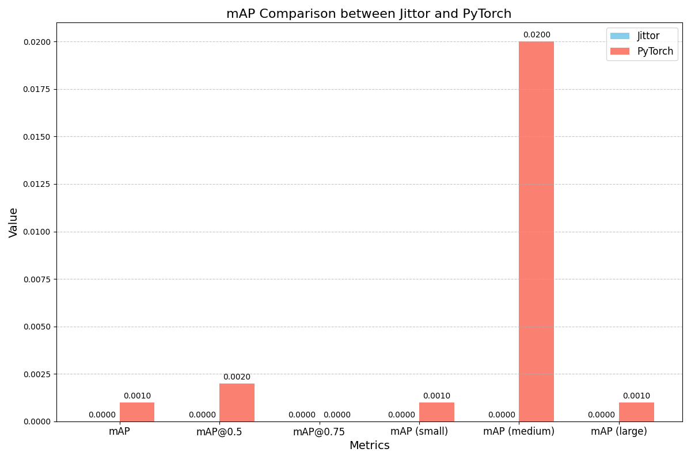

# GFL在Jittor和PyTorch框架下的对比报告

报告生成时间: 2025-05-20 11:14:51

## 训练配置

Jittor配置文件: `/root/data-fs/GFocalV2/GFocalV2Jittor/configs/gfl/gfl_r50_fpn_coco_1x_enhanced.yml`

PyTorch配置文件: `/root/data-fs/GFocalV2/GFocalV2Pytorch/configs/gfl/gfl_r50_fpn_1x_coco.py`

## 训练记录统计

| 框架 | 记录的迭代次数 | 记录的Epoch数 |
|------|--------------|------------|
| Jittor | 12 | 3 |
| PyTorch | 0 | 0 |

## 损失函数对比

| 指标 | Jittor | PyTorch | 差异比例 |
|------|--------|---------|----------|
| 平均总损失 | 数据不可用 | 数据不可用 | - |
| 平均分类损失 | 数据不可用 | 数据不可用 | - |
| 平均边界框损失 | 数据不可用 | 数据不可用 | - |
| 平均DFL损失 | 数据不可用 | 数据不可用 | - |

> **注意**: 日志中未找到完整的损失记录，建议修改训练代码添加详细的损失打印。

## 训练性能对比

| 指标 | Jittor | PyTorch | 比例 |
|------|--------|---------|------|
| 平均每次迭代时间 | 数据不可用 | 数据不可用 | - |

> **注意**: 日志中未找到完整的时间记录，建议修改训练代码添加详细的时间打印。

## 评估结果对比

| 指标 | Jittor | PyTorch | 差异比例 |
|------|--------|---------|----------|
| mAP | 0.0000 | 0.0010 | 100.00% |
| mAP@0.5 | 0.0000 | 0.0020 | 100.00% |
| mAP@0.75 | 0.0000 | 0.0000 | N/A |
| mAP (small) | 0.0000 | 0.0010 | 100.00% |
| mAP (medium) | 0.0000 | 0.0200 | 100.00% |
| mAP (large) | 0.0000 | 0.0010 | 100.00% |
## 评估指标对比图

## 结论

### 1. 损失函数对齐情况

日志中未找到完整的损失记录，无法评估损失函数的对齐情况。建议修改训练代码，添加详细的损失打印。

### 2. 训练性能

日志中未找到完整的时间记录，无法评估训练性能。建议修改训练代码，添加详细的时间打印。

### 3. 评估结果

两个框架的评估结果存在明显差异，mAP差异达100.00%，需要进一步调查原因。 其中，小物体(差异100.00%), 中物体(差异100.00%), 大物体(差异100.00%)的检测精度差异较大，可能需要重点关注这些尺寸物体的检测实现。

### 4. 总体结论

由于日志数据不完整，无法做出全面的对齐结论。建议修改训练代码添加更详细的日志记录，并重新运行测试，以便进行更准确的对比分析。