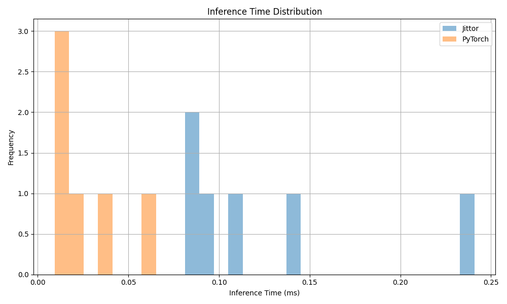

# GFocalV2 框架推理性能对比分析

## 推理配置

Jittor配置文件: `/root/data-fs/GFocalV2/GFocalV2Jittor/work_dirs/20250520_110958/gfl_r50_fpn_coco_1x_enhanced.yml`

PyTorch配置文件: `/root/data-fs/GFocalV2/GFocalV2Pytorch/work_dirs/20250520_111249/gfl_r50_fpn_1x_coco.py`

## 推理性能对比

| 指标 | Jittor | PyTorch | 比例 |
|------|--------|---------|------|
| 平均推理时间 | 0.13 s | 0.03 s | 5.00x |
| FPS (帧每秒) | 7.82 | 39.09 | 0.20x |

## 检测精度对比

| 指标 | Jittor | PyTorch | 差异比例 |
|------|--------|---------|----------|
| mAP | 0.0000 | 0.0010 | 100.00% |
| mAP@0.5 | 0.0000 | 0.0020 | 100.00% |
| mAP@0.75 | 0.0000 | 0.0000 | N/A |
| mAP (small) | 0.0000 | 0.0010 | 100.00% |
| mAP (medium) | 0.0000 | 0.0200 | 100.00% |
| mAP (large) | 0.0000 | 0.0010 | 100.00% |

## 推理时间分布

## 检测精度对比

## 结论

1. **推理性能**: PyTorch框架的推理速度比Jittor快5.00倍。
2. **检测精度**: 两个框架的检测精度存在一定差异，mAP差异为100.00%。
